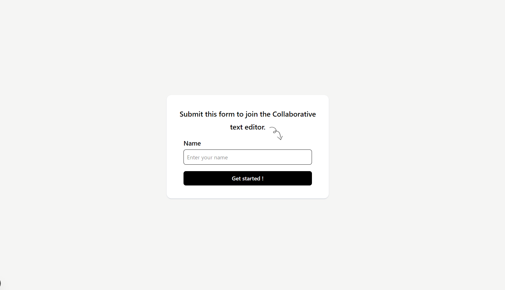
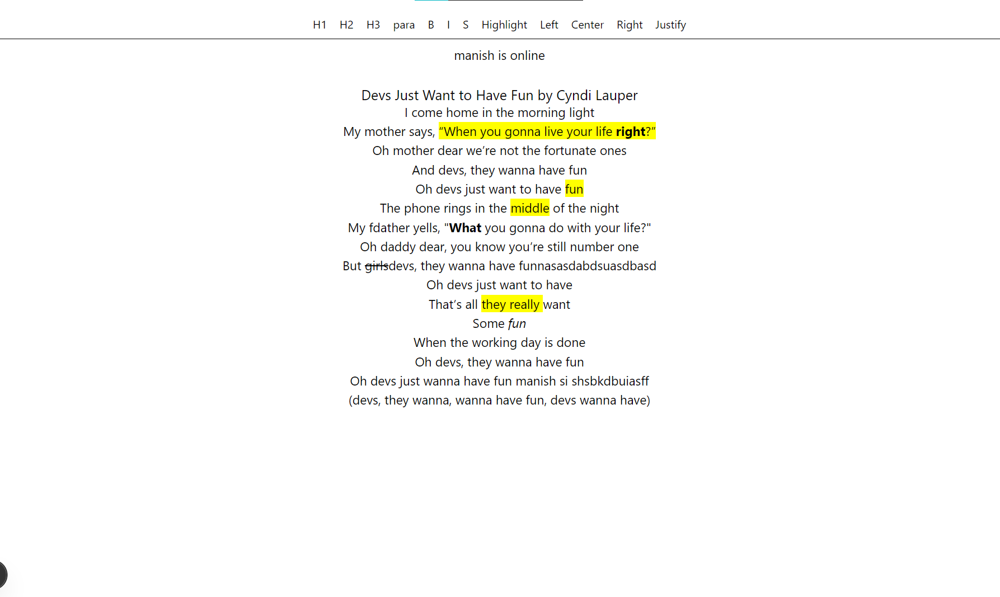

# Real-Time Collaborative Text Editor – Internship Task 1

A real-time collaborative text editor built using ReactJS, TypeScript,tiptap and TailwindCSS. This application allows multiple users to edit the same document simultaneously.

## 📌 Table of Contents
- [About](#about)
- [Features](#features)
- [Technologies Used](#technologies-used)
- [How to Run](#how-to-run)
- [Screenshots](#screenshots)

---

## 🧾 About

This project fulfills the requirements for Task 1 of the Frontend Developer Intern assignment. It implements a basic real-time collaborative text editor where multiple users can connect, edit, and view content updates instantly.

The goal was to demonstrate:
- Real-time synchronization between users.
- User identification during edits.
- Clean architecture and use of modern frontend technologies.

The implementation uses ReactJS with TypeScript with tiptap and simulates real-time collaboration without requiring a backend server.

---

## 🔧 Features

✅ Real-time editing across multiple users  
✅ Responsive and clean UI using TailwindCSS  
✅ Simple username prompt at start  

---

## ⚙️ Technologies Used

- **ReactJS** – For building the UI components
- **TypeScript** – For type safety and better developer experience
- **TailwindCSS** – For responsive and utility-first styling
- **Tiptap** – For creating realtime text editor collaboration

---

## ▶️ How to Run

### Prerequisites

- Node.js (v14 or higher)
- npm or yarn installed

### Steps

1. Clone the repository:

```bash
git clone https://github.com/yourusername/realtime-editor.git 

2. Install dependencies, Start the development server:
```bash
npm install
npm run dev


3. Create .env.local file:
Add NEXT_PUBLIC_APP_ID from your tiptap cloud
Add APP_SECRET from your tiptap cloud 

### 📸 Screenshote 



